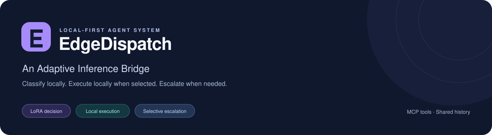
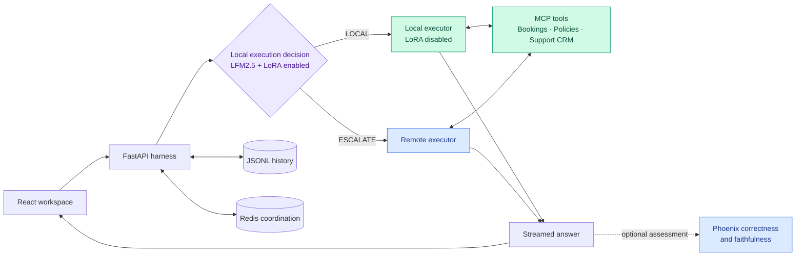

<p align="center">
  
</p>

<p align="center">
  
  
  
  
</p>

<p align="center">
  <a href="docs/ltu_thesis_b_v1.pdf"><strong>Read the thesis</strong></a> ·
  <a href="#architecture">Architecture</a> ·
  <a href="#run-locally">Run locally</a> ·
  <a href="training/README.md">Training &amp; evaluation</a>
</p>

## About the thesis

**A blueprint for turning agent execution evidence into learned local capability decisions.**

EdgeDispatch connects **data collection, capability assessment and supervised fine-tuning** to learn which tasks a local model can complete and which it should escalate. Where organisations retain agent execution records, those traces can provide representative requests, conversation context and tool interactions for assessing a chosen local model. Executing those tasks with that model and reviewing its outcomes provides training evidence for the local-or-escalate decision.

We demonstrate this **Adaptive Inference Bridge** in a synthetic airline support environment. We gathered and reviewed local execution outcomes to construct **1,020 training contexts from 210 source conversations**, then fine-tuned an **execution-decision LoRA adapter for four epochs** on **LFM2.5-2.6B**. The adapter predicts `LOCAL` or `ESCALATE` from a request and its available context. It is disabled while the unchanged local base completes retained work, and escalated requests use a remote model. Both paths share MCP tools and conversation history.

The thesis evaluates the learned classifier separately from complete-answer quality and remote execution API cost, comparing local-only, remote-only and adaptive execution. The reusable contribution is the process from reviewed execution evidence to a trained decision and evaluated service outcomes. Applying it to another model or enterprise workflow requires assessing that local executor on representative tasks.

**Dolwin Fernandes · Master of Artificial Intelligence · La Trobe University · October 2026**
Supervisor: Dr. Phu Lai · [Completed thesis (PDF)](docs/ltu_thesis_b_v1.pdf)

### Research highlights

| Measurement | Reported result |
| --- | --- |
| Reviewed local failures identified for escalation | **100/111 · 90.09% recall** |
| Mixed-workload requests completed locally | **26/50 · 52%** |
| Mixed-workload answer delivery | **50/50** |
| Correctness / faithfulness judge passes | **46/50 · 92%** / **47/50 · 94%** |
| Remote execution API-cost reduction | **13.74%** relative to remote-only |

Classifier results cover 197 scored contexts from 200 attempted contexts. Answer-quality and cost results use the fixed 50-question mixed workload, with GPT-5.6 Luna as the remote executor and Phoenix native evaluators. They describe this experiment; API-cost savings exclude local hardware and evaluation costs. See Chapters 4–5 of the thesis for methods, denominators and limitations, or inspect the [recomputed results](docs/evidence/results.json).

## Architecture



The harness owns tool execution, streaming, cancellation, approvals, conversation storage and escalation policy. Redis coordinates active requests; JSONL files retain history. The three read-only MCP servers expose reproducible synthetic airline data.

[Editable harness diagram](docs/figures/harness_flow.drawio) · [Capability-assessment diagram](docs/figures/capability_assessment.drawio)

## Run locally

Requires **Python 3.12+**, **uv**, **Node 22.13+ or 24+**, **Docker**, a compatible **llama.cpp** build and the separate [model files](docs/configuration.md#model-files). Set `EDGE_ARTIFACTS_DIR` to the model bundle location; the example configuration uses `../thesis_artifacts`.

From the **EdgeDispatch** repository root:

```bash
uv sync --locked --extra dev
cp -n .env.example .env
docker compose up -d redis
```

Set `OPENAI_API_KEY` and a remote model accessible to your account in `.env`. The recorded experiment used `gpt-5.6-luna`. Local execution requires the selected model artifacts; remote escalation requires valid provider access.

Start each process in its own terminal:

**Local model** — from the repository root:

```bash
uv run --locked --env-file .env python -m server.agent.serving --llama-dir ../llama.cpp
```

**Backend** — from the repository root, with one worker:

```bash
uv run --locked --env-file .env uvicorn server.main:app --host 127.0.0.1 --port 8000
```

**Frontend:**

```bash
cd frontend
npm ci
npm run dev -- --host 127.0.0.1 --strictPort
```

Open [the workspace](http://127.0.0.1:5173). **Settings & connections** shows model, MCP and Redis readiness. The backend starts the MCP servers automatically. [API documentation](http://127.0.0.1:8000/docs) and [health](http://127.0.0.1:8000/api/health) are available locally.

Chats default to **Stay remote after escalation**. Select **Classify every new request** to reassess each turn. The selected thesis adapter uses the `direct` decision format. [Configuration and optional answer assessment](docs/configuration.md) explain the remaining settings.

This is a single-user research application. Keep services bound to loopback. Escalation sends relevant conversation history and tool results to the remote provider; local JSONL history also contains this content.

## Repository guide

| Path | Purpose |
| --- | --- |
| [`frontend/src/`](frontend/src/) | React chat workspace, settings and SSE client |
| [`server/`](server/) | FastAPI API, execution decisions, agent harness and optional assessment |
| [`mcp_server_db/`](mcp_server_db/), [`mcp_server_wiki/`](mcp_server_wiki/), [`mcp_server_crm/`](mcp_server_crm/) | Airline MCP tools |
| [`mock_airline/`](mock_airline/) | Synthetic SQL fixtures and read-only data access |
| [`training/`](training/) | Selected training procedure and offline result verification |
| [`docs/`](docs/) | Thesis PDF, diagrams and setup reference |

Model weights, frozen experiment records, runtime logs, caches and build output are excluded from Git.

## Development checks

```bash
uv run --locked --extra dev ruff check server mcp_server_db mcp_server_crm mcp_server_wiki mock_airline training
uv run --locked --extra dev ruff format --check server mcp_server_db mcp_server_crm mcp_server_wiki mock_airline training
uv run --locked --extra dev mypy
cd frontend
npm run lint
npm run typecheck
npm run build
```

Mypy currently covers the decision client. These checks do not call model providers; model inference, remote access and GPU training are separate runtime checks. Research evaluation commands are documented in [`training/README.md`](training/README.md).
